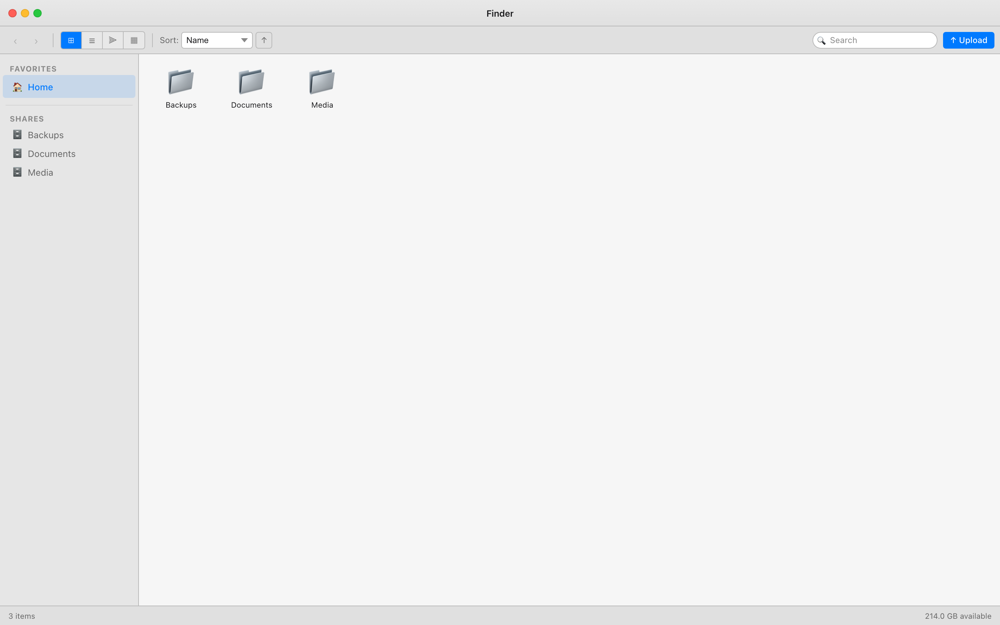
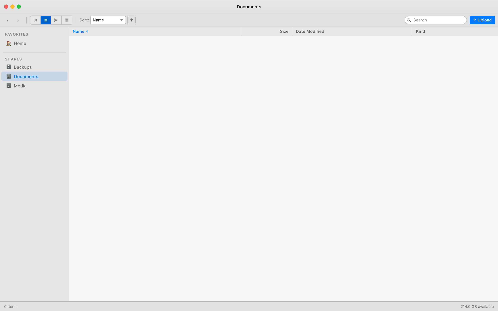
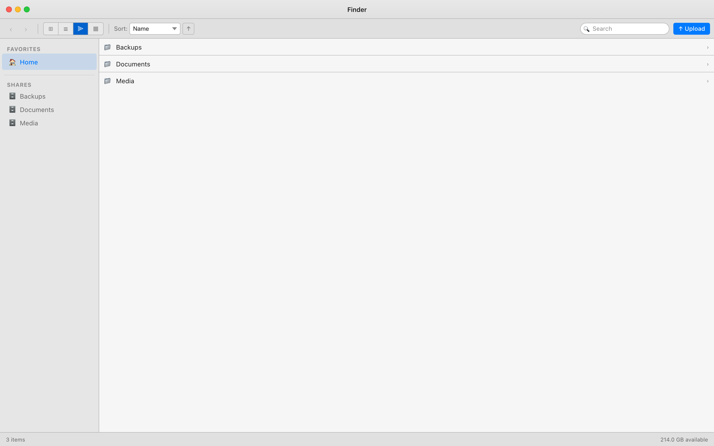
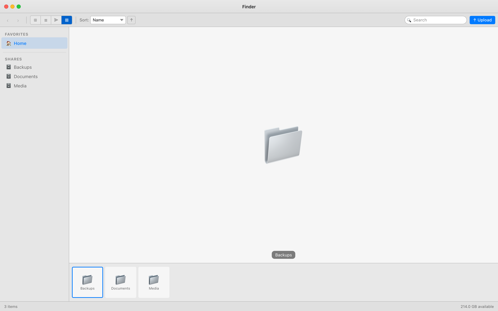
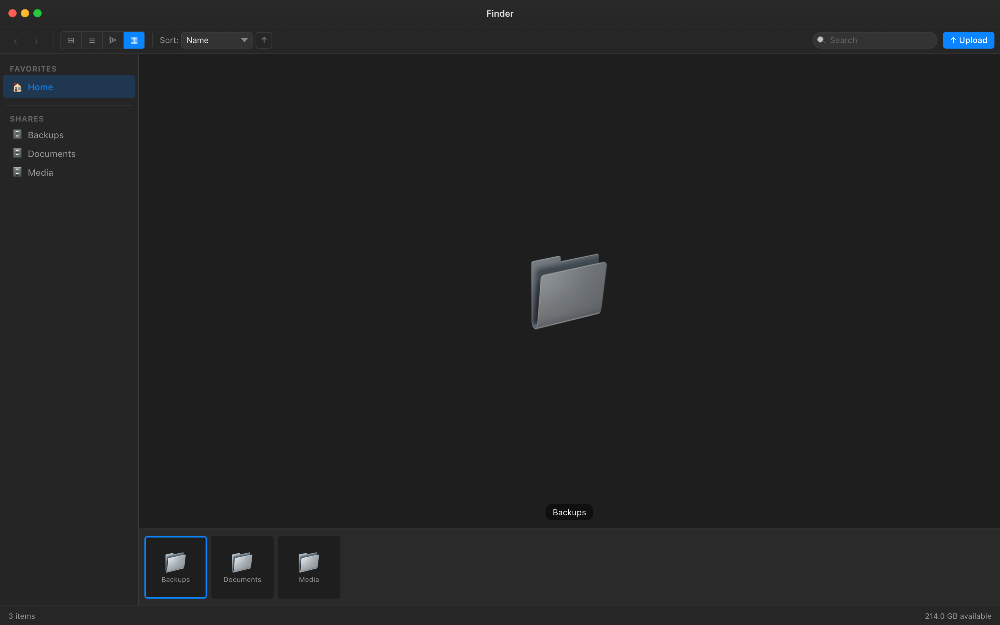
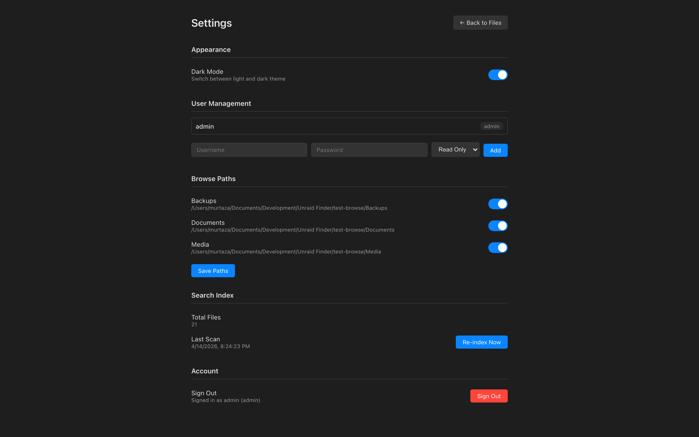
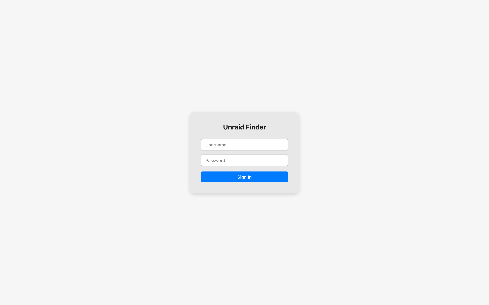

# Unraid Finder

**A macOS Finder-style file browser for your Unraid NAS**

Browse, preview, search, upload, download, and manage files across your Unraid shares with a familiar, polished interface — all from the browser.

## Screenshots

### Icon View (Light Mode)


### List View


### Column View


### Gallery View


### Dark Mode


### Settings


### Login


---

## Features

### Four View Modes

| Mode | Description |
|------|-------------|
| **Icon** | Large thumbnails with filename labels — great for media-heavy folders |
| **List** | Compact rows with name, size, kind, and date modified columns |
| **Column** | Miller-columns navigation — drill into folders while keeping parent context visible |
| **Gallery** | Full-width preview pane alongside a scrollable file strip — ideal for photos |

### Quick Look

Press **Space** to instantly preview the selected file without opening an external app:

- Images (JPEG, PNG, GIF, WebP, SVG, …)
- Video (MP4, WebM, MOV, …)
- Audio (MP3, FLAC, WAV, OGG, …)
- PDF documents
- Code and plain text with syntax highlighting

### File Management

- Create, rename, and delete files and folders
- Drag-and-drop upload — drop files anywhere on the window
- Download individual files or select multiple and download as a ZIP archive
- Clipboard shortcuts: Cut / Copy / Paste (Cmd/Ctrl+X / C / V)
- Bulk operations: select all, delete selection, move selection
- Compress folders or selections into ZIP; extract ZIP archives in place
- Right-click context menu for all common actions

### Search

- **Instant search** in the current directory — results appear as you type
- **Recursive search** across the entire share powered by a background SQLite index
- The index is rebuilt on a configurable schedule (default: every 60 minutes)

### Multi-User Authentication

- Role-based access control with three roles: **admin**, **full** (read/write), and **readonly**
- Per-path permissions — grant users access to specific shares only
- Passwords stored with bcrypt; sessions protected by signed JWT tokens
- Admin account created automatically from environment variables on first run

### Appearance

- Automatic light / dark mode following the OS preference
- Manual override available in the settings panel

---

## Installation

### Unraid (Community Applications / Template)

1. In the Unraid web UI, go to **Apps** and search for **UnraidFinder**, or manually add the template URL:
   ```
   https://raw.githubusercontent.com/murtaza911/unraid-finder/main/unraid-template.xml
   ```
2. Click **Install** and fill in:
   - **Web UI Port** — default `3000`
   - **App Data** — e.g. `/mnt/user/appdata/unraid-finder`
   - **Media** / **Documents** — map your Unraid shares to `/browse/<ShareName>`
   - **Admin Username** and **Admin Password**
3. Click **Apply**. The container will pull, start, and be accessible at `http://<unraid-ip>:3000`.

To expose additional shares, add more **Path** mappings in the container settings with a **Container Path** of `/browse/<YourShareName>`.

### Docker (manual)

```bash
docker run -d \
  --name unraid-finder \
  -p 3000:3000 \
  -v /path/to/appdata:/app/data \
  -v /mnt/user/Media:/browse/Media \
  -v /mnt/user/Documents:/browse/Documents \
  -e ADMIN_USERNAME=admin \
  -e ADMIN_PASSWORD=changeme \
  -e JWT_SECRET=change-this-secret \
  ghcr.io/murtaza911/unraid-finder:latest
```

### Docker Compose

```yaml
version: "3.8"
services:
  unraid-finder:
    image: ghcr.io/murtaza911/unraid-finder:latest
    ports:
      - "3000:3000"
    volumes:
      - ./data:/app/data
      - /mnt/user/Media:/browse/Media
      - /mnt/user/Documents:/browse/Documents
    environment:
      - ADMIN_USERNAME=admin
      - ADMIN_PASSWORD=changeme
      - JWT_SECRET=change-this-secret
    restart: unless-stopped
```

---

## Configuration

### Adding More Shares

Mount any host path to a sub-directory under `/browse/` inside the container:

```
-v /mnt/user/Photos:/browse/Photos
```

That share will immediately appear in the sidebar under **Photos**.

### In-App Settings

Navigate to **Settings** (gear icon in the top bar) to:

- Manage users and their roles / path permissions
- Trigger or schedule a search index rebuild
- Toggle the colour theme

### Environment Variables

| Variable | Default | Description |
|----------|---------|-------------|
| `PORT` | `3000` | Port the server listens on |
| `ADMIN_USERNAME` | `admin` | Username for the auto-created admin account |
| `ADMIN_PASSWORD` | *(required)* | Password for the auto-created admin account |
| `JWT_SECRET` | *(auto-generated)* | Secret used to sign JWT tokens. Set explicitly to survive container restarts |
| `BROWSE_ROOT` | `/browse` | Root directory exposed to the file browser |
| `DATA_DIR` | `/app/data` | Directory for the SQLite database and persistent config |
| `INDEX_INTERVAL_MINUTES` | `60` | How often the background search index is rebuilt (minutes) |

---

## Development

### Prerequisites

- Node.js 20+
- npm 10+

### Setup

```bash
git clone https://github.com/murtaza911/unraid-finder.git
cd unraid-finder
npm install
```

### Run in Development Mode

```bash
npm run dev
```

This starts the Express server (with `tsx watch`) on port `3000` and the Vite dev server for the React client concurrently. The client proxies API requests to the server automatically.

### Run Tests

```bash
npm test
```

Server-side tests are run with Vitest. Test files live in `server/__tests__/`.

### Production Build

```bash
npm run build
```

Compiles the React client to `client/dist/` and transpiles the TypeScript server to `server/dist/`.

### Build the Docker Image

```bash
docker build -t unraid-finder .
```

Or use Docker Compose:

```bash
docker compose up --build
```

---

## Tech Stack

| Layer | Technology |
|-------|-----------|
| Frontend | React 19, TypeScript, Vite |
| State management | Zustand |
| HTTP client | Axios |
| Backend | Express 5, TypeScript, Node.js 20 |
| Database | SQLite via `better-sqlite3` |
| Authentication | bcrypt (password hashing), JSON Web Tokens |
| File ops | Multer (upload), Archiver (zip), Unzipper (extract) |
| Testing | Vitest, Supertest |

---

## Keyboard Shortcuts

| Shortcut | Action |
|----------|--------|
| `Space` | Quick Look preview of selected file |
| `Enter` | Open selected file or navigate into folder |
| `Backspace` | Navigate to parent folder |
| `Cmd/Ctrl + A` | Select all items in the current view |
| `Cmd/Ctrl + C` | Copy selected items to clipboard |
| `Cmd/Ctrl + X` | Cut selected items to clipboard |
| `Cmd/Ctrl + V` | Paste clipboard items into current folder |
| `Delete` | Delete selected items |
| `Escape` | Deselect all / dismiss Quick Look |
| `1` | Switch to Icon view |
| `2` | Switch to List view |
| `3` | Switch to Column view |
| `4` | Switch to Gallery view |

---

## License

MIT — see [LICENSE](LICENSE) for details.
